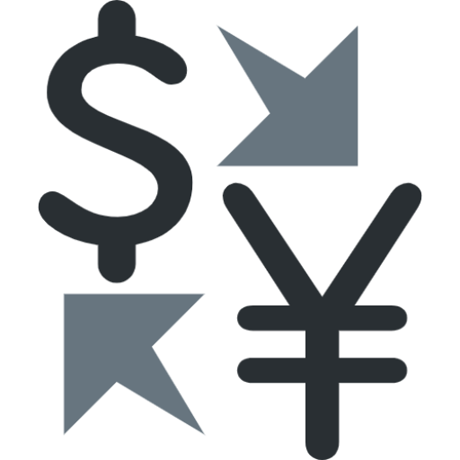

<!-- Improved compatibility of back to top link: See: https://github.com/othneildrew/Best-README-Template/pull/73 -->
<a name="readme-top"></a>
<!--
*** Thanks for checking out the Best-README-Template. If you have a suggestion
*** that would make this better, please fork the repo and create a pull request
*** or simply open an issue with the tag "enhancement".
*** Don't forget to give the project a star!
*** Thanks again! Now go create something AMAZING! :D
-->


<!-- PROJECT SHIELDS -->
<!--
*** I'm using markdown "reference style" links for readability.
*** Reference links are enclosed in brackets [ ] instead of parentheses ( ).
*** See the bottom of this document for the declaration of the reference variables
*** for contributors-url, forks-url, etc. This is an optional, concise syntax you may use.
*** https://www.markdownguide.org/basic-syntax/#reference-style-links
-->
[![Contributors][contributors-shield]][contributors-url]
[![Forks][forks-shield]][forks-url]
[![Stargazers][stars-shield]][stars-url]
[![Issues][issues-shield]][issues-url]
[![MIT License][license-shield]][license-url]
[![LinkedIn][linkedin-shield]][linkedin-url]


<!-- PROJECT LOGO -->
<br />
<div align="center">
  <a href="https://github.com/Finns841594/Currency">
    
  </a>

<h3 align="center">Multiy-Currency Accountinge</h3>

  <p align="center">
    project_description
    <br />
    <a href="https://github.com/Finns841594/Currency"><strong>Explore the docs »</strong></a>
    <br />
    <br />
    <a href="https://github.com/Finns841594/Currency">View Demo</a>
    ·
    <a href="https://github.com/Finns841594/Currency/issues">Report Bug</a>
    ·
    <a href="https://github.com/Finns841594/Currency/issues">Request Feature</a>
  </p>
</div>


<!-- TABLE OF CONTENTS -->
<details>
  <summary>Table of Contents</summary>
  <ol>
    <li>
      <a href="#about-the-project">About The Project</a>
      <ul>
        <li><a href="#built-with">Built With</a></li>
      </ul>
    </li>
    <li>
      <a href="#getting-started">Getting Started</a>
      <ul>
        <li><a href="#prerequisites">Prerequisites</a></li>
        <li><a href="#installation">Installation</a></li>
      </ul>
    </li>
    <li><a href="#usage">Usage</a></li>
    <li><a href="#roadmap">Roadmap</a></li>
    <li><a href="#contributing">Contributing</a></li>
    <li><a href="#license">License</a></li>
    <li><a href="#contact">Contact</a></li>
    <li><a href="#acknowledgments">Acknowledgments</a></li>
  </ol>
</details>


<!-- ABOUT THE PROJECT -->
## About The Project

[![Product Name Screen Shot][product-screenshot]](https://example.com)

This app can help you record your costs in different currencies(as many as you want!).
And you can specify one main currency, so all the costs will be summed up into nominated currency by the exchange rates of that day.

<p align="right">(<a href="#readme-top">back to top</a>)</p>


### Built With

* [![Flask][[Flask]]][Flask-url]
* [![PostgreSQL][[PostgreSQL]]][PostgreSQL-url]]
* [![Psycopg][[Psycopg]]][Psycopg-url]]
* [![Bootstrap][Bootstrap.com]][Bootstrap-url]


<p align="right">(<a href="#readme-top">back to top</a>)</p>


<!-- GETTING STARTED -->
## Getting Started

Visit the website and register a new account.


### If you want to modify

0. Set envrionment

Install Python3 
Install Python packages: Flask, Psycopg
Install PostgreSql

1. Get a free API Key at [https://openexchangerates.org/](https://openexchangerates.org/)
2. Clone the repo
   ```sh
   git clone https://github.com/Finns841594/Currency.git
   ```
3. Set the following environment variable for exchange rate
   `api3`
4. Set the following environment variable for database
    1. "DBNAME"
    2. "DBHOST"
    3. "DBUSER"
    4. "DBPASS"

<p align="right">(<a href="#readme-top">back to top</a>)</p>


<!-- CONTRIBUTING -->
## Contributing

Contributions are what make the open source community such an amazing place to learn, inspire, and create. Any contributions you make are **greatly appreciated**.

If you have a suggestion that would make this better, please fork the repo and create a pull request. You can also simply open an issue with the tag "enhancement".
Don't forget to give the project a star! Thanks again!

1. Fork the Project
2. Create your Feature Branch (`git checkout -b feature/AmazingFeature`)
3. Commit your Changes (`git commit -m 'Add some AmazingFeature'`)
4. Push to the Branch (`git push origin feature/AmazingFeature`)
5. Open a Pull Request

<p align="right">(<a href="#readme-top">back to top</a>)</p>


<!-- LICENSE -->
## License

Distributed under the MIT License. See `LICENSE.txt` for more information.

<p align="right">(<a href="#readme-top">back to top</a>)</p>


<!-- CONTACT -->
## Contact

Feng Yang - yangfengforwork@outlook.com

Project Link: [https://github.com/Finns841594/Currency](https://github.com/Finns841594/Currency)

<p align="right">(<a href="#readme-top">back to top</a>)</p>


<!-- ACKNOWLEDGMENTS -->
## Acknowledgments

* []()
* []()
* []()

<p align="right">(<a href="#readme-top">back to top</a>)</p>


<!-- MARKDOWN LINKS & IMAGES -->
<!-- https://www.markdownguide.org/basic-syntax/#reference-style-links -->
[contributors-shield]: https://img.shields.io/github/contributors/Finns841594/Currency.svg?style=for-the-badge
[contributors-url]: https://github.com/Finns841594/Currency/graphs/contributors
[forks-shield]: https://img.shields.io/github/forks/Finns841594/Currency.svg?style=for-the-badge
[forks-url]: https://github.com/Finns841594/Currency/network/members
[stars-shield]: https://img.shields.io/github/stars/Finns841594/Currency.svg?style=for-the-badge
[stars-url]: https://github.com/Finns841594/Currency/stargazers
[issues-shield]: https://img.shields.io/github/issues/Finns841594/Currency.svg?style=for-the-badge
[issues-url]: https://github.com/Finns841594/Currency/issues
[license-shield]: https://img.shields.io/github/license/Finns841594/Currency.svg?style=for-the-badge
[license-url]: https://github.com/Finns841594/Currency/blob/master/LICENSE.txt
[linkedin-shield]: https://img.shields.io/badge/-LinkedIn-black.svg?style=for-the-badge&logo=linkedin&colorB=555
[linkedin-url]: https://linkedin.com/in/feng-yang-511361166
[product-screenshot]: images/mainpage.png
[Bootstrap.com]: https://img.shields.io/badge/Bootstrap-563D7C?style=for-the-badge&logo=bootstrap&logoColor=white
[Bootstrap-url]: https://getbootstrap.com

[Flask]: https://flask.palletsprojects.com/en/2.2.x/_images/flask-logo.png
[Flask-url]: https://flask.palletsprojects.com/en/2.2.x/#
[PostgreSQL]: https://www.postgresql.org/media/img/about/press/elephant.png
[PostgreSQL-url]: https://www.postgresql.org

[Psycopg]: https://pbs.twimg.com/profile_images/1152122059/psycopg-100_400x400.png
[Psycopg-url]: https://www.psycopg.org